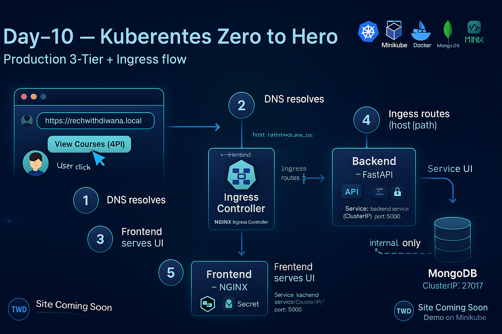

# 🚀 Day-10 — Production-Style 3-Tier Kubernetes Application with Ingress
### Frontend + Backend + MongoDB | ConfigMap + Secret | Jobs + CronJobs | NGINX Ingress Controller

## ⭐ Badges

  
  
  

# 📘 Overview
This project deploys a production-style 3-tier architecture on Kubernetes:
- Frontend (NGINX)
- Backend (FastAPI)
- MongoDB
- Ingress routing / and /api
- ConfigMap + Secret
- Job + CronJob

# 🧬 Architecture Diagram

# 🖥 Frontend Screenshot

# 📂 Repository Structure
(omitted for brevity)

# 🧠 Deep Explanation — Why Each Object Exists
- Namespace: isolation, cleanup
- ConfigMap: non-sensitive config
- Secret: secure credentials
- Mongo Deployment + Service: DB layer
- Backend Deployment + Service: API layer
- Frontend Deployment + Service: UI layer
- Ingress: single domain + routing
- Job: one-time validation
- CronJob: scheduled automation

# 🚀 Apply Commands
kubectl apply -f 01-namespace.yaml
kubectl apply -f k8s/

# 🔍 Verification
curl http://techwithdiwana.local/api/info

# 🧹 Cleanup
kubectl delete ns twd
