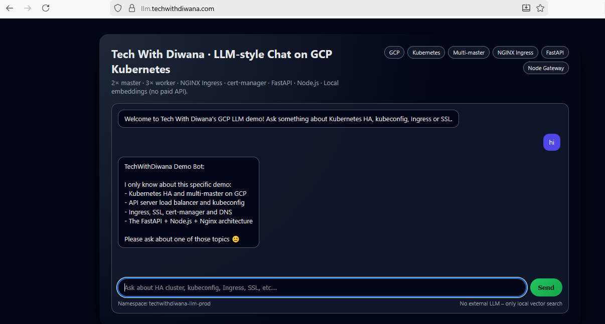

# 🚀 Tech With Diwana – GCP HA Kubernetes + LLM App (ZERO TO HERO)


---

## 📸 Application UI



---

## 🧠 Overview

This project demonstrates a **production-grade Highly Available Kubernetes cluster on GCP** using **kubeadm (no GKE)**.

Key highlights:
- External **HAProxy TCP Load Balancer**
- **Multi-master control plane**
- **containerd runtime**
- **NGINX Ingress Controller**
- **cert-manager with Let's Encrypt**
- **LLM-style application (Frontend + Node.js + FastAPI)**
- **Docker used ONLY for image build (never on k8s nodes)**
- **Complete cleanup to avoid billing**

---

## 🏗️ Architecture (WHAT / WHY / HOW)

### WHAT
A full bare-metal–style Kubernetes HA setup on cloud VMs.

### WHY
To learn **real Kubernetes & DevOps**, not managed abstractions.

### HOW

```
User
 |
 | https://llm.techwithdiwana.com
 |
DNS → Static Public IP
 |
HAProxy (VM)
 |-- 6443 → Kubernetes API
 |-- 80   → Ingress HTTP (cert-manager)
 |-- 443  → Ingress HTTPS (Application)
 |
NGINX Ingress
 |
Services
 |
Pods (Frontend | Node.js | FastAPI)
```

---

# 🔹 PHASE -1 – GCP Account & Billing

**WHAT:** Create GCP account and project  
**WHY:** Without billing, resources cannot be created  
**HOW:**  
- https://console.cloud.google.com  
- Create project  
- Enable billing  

---

# 🔹 PHASE 0 – Google Cloud CLI (Windows)

```powershell
winget install -e --id Google.CloudSDK
```
Restart PowerShell:
```powershell
gcloud init
gcloud config set project <PROJECT_ID>
gcloud config set compute/region asia-south1
gcloud config set compute/zone asia-south1-a
gcloud services enable compute.googleapis.com iam.googleapis.com
```

---

# 🔹 PHASE 1 – SSH Key

```powershell
ssh-keygen -t ed25519 -f $HOME\.ssh\gcp-techwithdiwana
cat $HOME\.ssh\gcp-techwithdiwana.pub
```

---

# 🔹 PHASE 2 – VM Creation

```powershell
$ZONE="asia-south1-a"
$MACHINE="e2-medium"

foreach ($vm in "haproxy-1","k8s-master-1","k8s-master-2","k8s-worker-1","k8s-worker-2") {
  gcloud compute instances create $vm `
    --zone=$ZONE `
    --machine-type=$MACHINE `
    --image-family=ubuntu-2204-lts `
    --image-project=ubuntu-os-cloud `
    --boot-disk-size=50GB `
    --tags=k8s-node
}
```

---

# 🔹 PHASE 3 – Firewall

```powershell
gcloud compute firewall-rules create allow-k8s-all `
  --allow tcp:22,tcp:80,tcp:443,tcp:6443,tcp:30000-32767 `
  --source-ranges 0.0.0.0/0 `
  --target-tags k8s-node
```

---

## ⚠️ NOTE
PHASE 4–6 must be executed on **ALL Kubernetes nodes**.

---

# 🔹 PHASE 4 – Linux Prep

```bash
sudo -i
swapoff -a
sed -i '/ swap / s/^/#/' /etc/fstab
modprobe overlay
modprobe br_netfilter
cat <<EOF >/etc/sysctl.d/k8s.conf
net.bridge.bridge-nf-call-iptables=1
net.bridge.bridge-nf-call-ip6tables=1
net.ipv4.ip_forward=1
EOF
sysctl --system
```

---

# 🔹 PHASE 5 – containerd Runtime

```bash
apt update && apt install -y containerd
mkdir -p /etc/containerd
containerd config default > /etc/containerd/config.toml
sed -i 's/SystemdCgroup = false/SystemdCgroup = true/' /etc/containerd/config.toml
sed -i 's|sandbox_image = .*|sandbox_image = "registry.k8s.io/pause:3.9"|' /etc/containerd/config.toml
systemctl daemon-reexec
systemctl restart containerd
systemctl enable containerd
```

---

# 🔹 PHASE 6 – Kubernetes Binaries

```bash
apt install -y apt-transport-https ca-certificates curl gpg
curl -fsSL https://pkgs.k8s.io/core:/stable:/v1.29/deb/Release.key |
gpg --dearmor -o /etc/apt/keyrings/kubernetes.gpg
echo "deb [signed-by=/etc/apt/keyrings/kubernetes.gpg] https://pkgs.k8s.io/core:/stable:/v1.29/deb/ /" > /etc/apt/sources.list.d/kubernetes.list
apt update
apt install -y kubeadm kubelet kubectl
apt-mark hold kubeadm kubelet kubectl
```

---

# 🔹 PHASE 7 – HAProxy (K8s API)

```cfg
apt update
apt install -y haproxy

nano /etc/haproxy/haproxy.cfg

frontend kubernetes
    bind *:6443
    mode tcp
    default_backend k8s-masters

backend k8s-masters
    mode tcp
    balance roundrobin
    server master1 <MASTER1_PRIVATE_IP>:6443 check
    server master2 <MASTER2_PRIVATE_IP>:6443 check

systemctl restart haproxy
systemctl enable haproxy
```

---

# 🔹 PHASE 8 – kubeadm init

```bash
kubeadm init --control-plane-endpoint <HAPROXY_PRIVATE_IP>:6443 --pod-network-cidr=10.244.0.0/16 --upload-certs
```

---

# 🔹 PHASE 9 – Join Nodes

(Master & workers via kubeadm join)

---

# 🔹 PHASE 10 – CNI

```bash
kubectl apply -f https://raw.githubusercontent.com/flannel-io/flannel/master/Documentation/kube-flannel.yml
```

---

# 🔹 PHASE 11 – Ingress Controller

```bash
kubectl apply -f https://raw.githubusercontent.com/kubernetes/ingress-nginx/controller-v1.11.1/deploy/static/provider/baremetal/deploy.yaml
```

---

# 🔹 PHASE 12 – cert-manager

```bash
kubectl apply -f https://github.com/cert-manager/cert-manager/releases/latest/download/cert-manager.yaml
```

---

# 🔹 PHASE 12.5 – HAProxy Ingress (80 / 443)

```bash
kubectl get svc ingress-nginx-controller -n ingress-nginx
sudo nano /etc/haproxy/haproxy.cfg
```

```cfg
frontend ingress_https
    bind *:443
    mode tcp
    default_backend ingress_https_back

backend ingress_https_back
    mode tcp
    balance roundrobin
    server worker1 <WORKER1_PRIVATE_IP>:<HTTPS_NODEPORT> check
    server worker2 <WORKER2_PRIVATE_IP>:<HTTPS_NODEPORT> check

frontend ingress_http
    bind *:80
    mode tcp
    default_backend ingress_http_back

backend ingress_http_back
    mode tcp
    balance roundrobin
    server worker1 <WORKER1_PRIVATE_IP>:<HTTP_NODEPORT> check
    server worker2 <WORKER2_PRIVATE_IP>:<HTTP_NODEPORT> check
```

```bash
systemctl restart haproxy
```

---

# 🔹 PHASE 13 – Docker Image Build (NOT on k8s nodes)

Docker images MUST be built on:
- Local laptop
- Dedicated Docker VM
- CI/CD pipeline

```bash
docker build -t techwithdiwana/llm-fastapi:v1 .
docker push techwithdiwana/llm-fastapi:v1
```

---

# 🔹 PHASE 14 – Application Deploy

```bash
kubectl apply -f k8s/namespace.yaml
kubectl apply -f k8s/
```

---

# 🔹 PHASE 15 – SSL (Let's Encrypt)

```bash
letsencrypt-prod.yaml

apiVersion: cert-manager.io/v1
kind: ClusterIssuer
metadata:
  name: letsencrypt-prod
spec:
  acme:
    email: techwithdiwana@gmail.com
    server: https://acme-v02.api.letsencrypt.org/directory
    privateKeySecretRef:
      name: letsencrypt-prod
    solvers:
    - http01:
        ingress:
          class: nginx

kubectl apply -f letsencrypt-prod.yaml
kubectl describe clusterissuer letsencrypt-prod


------------------------------------------------

Within 2–5 minutes:

cert-manager issues SSL

Browser shows 🔒

FINAL CHECK

kubectl get pods -A
kubectl get ingress -n techwithdiwana-llm-prod
kubectl apply -f letsencrypt-prod.yaml
```

---

# 🧹 PHASE 16 – CLEANUP

```powershell
gcloud compute instances delete haproxy-1 k8s-master-1 k8s-master-2 k8s-worker-1 k8s-worker-2 --zone=asia-south1-a --quiet
gcloud compute firewall-rules delete allow-k8s-all --quiet
gcloud compute addresses delete <STATIC_IP_NAME> --region=asia-south1 --quiet
```

---

## 📜 License
MIT License © Tech With Diwana
